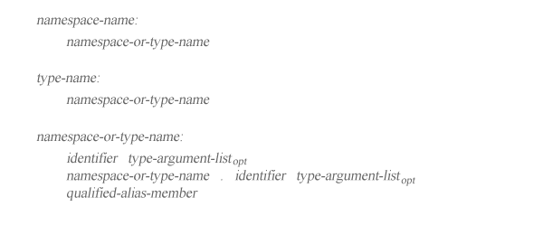

# 命名空间与类型名

C# 程序的上下文要求指定命名空间名标记 `namespace-name` 或类型名标记 `type-name`。



`namespace-name` 标记是一个引用命名空间的 `namespace-or-type-name` 标记，它根据如下描述执行解析工作（resolution），`namespace-name` 的 `namespace-or-type-name` 标记必须引用一个命名空间，不然将会出现「编译时错误」。没有类型实参（type arguments，第四章第 4.1 节）可以在 `namespace-name` 中出现（只有类型才能具有类型实参）。

`type-name` 标记是一个引用类型的 `namespace-or-type-name` 标记，它根据如下描述执行解析工作，`type-name` 的 `namespace-or-type-name` 标记必须引用一个类型，不然会出现「编译时错误」。

如果 `namespace-or-type-name` 标记是 `qualified-alias-member` 标记，则其含义如第九章第七节所述。否则 `namespace-or-type-name` 标记有以下四种形式：

- `I`
- `I<A1, ..., AK>`
- `N.I`
- `N.I<A1, ..., AK>`

其中 `I` 是单一修饰符（single identifier），`N` 是 `namespace-or-type-name`，`<A1, ..., AK>` 是可选的 `type-argument-list`。当没有 `type-argument-list` 被指定时，`K` 将为零（zero）。

`namespace-or-type-name` 的含义取决于如下：

- 如果 `namespace-or-type-name` 标记是 `I` 或 `I<A1, ..., AK>` 的形式的话：
	- 如果 `K` 是零（zero）， `namespace-or-type-name` 标记出现在一个泛型方法声明（generic method declaration，第十章第六节）内且其声明还包含名为 `I` 的类型形参（type parameter，第十章第 1.3 节），那么 `namespace-or-type-name` 引用该类型形参；
	- 不然的话，如果 `namespace-or-type-name` 标记出现在类型声明内，那么类型 `T` 的每个实例（第十章第 3.1 节），从该类型声明的实例类型开始，每个闭包类（enclosing class）或结构声明（如果有的话）的实例类型继续如下过程：
		- 如果 `K` 是零，`T` 的声明包含名为 `I` 的类型形参，那么 `namespace-or-type-name` 标记引用该类型形参；
		- 不然的话，如果 `namespace-or-type-name` 出现在类型声明主体（body）内部，同时 `T` 或或其任意基类包含具有名称 `I` 的 `K` 个类型形参的嵌套可访问类型（nested accessible type），那么 `namespace-or-type-name` 标记引用该给定类型实参（type arguments）构造的类型。如果存在多个该类型，则选择类型声明于较大程序派生类型内的那个类型。要注意，当确定了 `namespace-or-type-name` 标记的含义之后，非类型成员（non-type members，包括常量、字段、方法、属性、索引器、操作符、实例构造函数、析构函数以及静态构造函数）以及带有不同数量类型形参的类型成员都将被忽略。

	- 如果前述步骤都不成功，则对每个命名空间 `N`，起始于出现 `namespace-or-type-name` 标记的命名空间，持续到每一个闭包命名空间（如果有的话），直至止于全局命名空间（global namespace），对以下步骤进行运算直至定位到（located）一个实体：
		- 如果 K 是零，同时 I 是 N 内命名空间的名称，则：
			- 如果 `namespace-or-type-name` 出现的位置闭包于名为 `N` 的命名空间定义内，同时该命名空间定义包含了一个名为 `I` 的与某命名空间或类型相关的 `extern-alias-directive` 标记或 `using-alias-directive` 标记，那么 `namespace-or-type-name` 标记将模棱两可并会出现一个「编译时错误」。
			- 否则的话，`namespace-or-type-name` 引用 `N` 内的命名空间 `I`。
		- 不然的话，如果 N 包含拥有名为 I 且有 K 个类型形参的可访问类型，则：
			- 如果 `K` 是零且 `namespace-or-type-name` 标记出现的位置闭包于名为 `N` 的命名空间声明内，同时命名空间声明包含名为 `I` 的与某类型或命名空间相关的 `extern-alias-directive` 或 `using-alias-directive` 标记，那么 `namespace-or-type-name` 标记将模棱两可并会出现一个「编译时错误」。
			- 否则的话，`namespace-or-type-name` 标记引用由给定类型实参构建的类型。
		- 再不然的话，如果 `namespace-or-type-name` 标记出现的位置闭包于名为 `N` 的命名空间声明内的话，则：
			- 如果 `K` 是零并且命名空间包含了名为 `I` 的与某个导入的命名空间或类型相关的 `extern-alias-directive `或 `using-alias-directive` 标记，那么 `namespace-or-type-name` 将引用该命名空间或类型。
			- 不然的话，如果由 `using-namespace-directives` 标记导入命名空间声明的命名空间确切包含一个名为 `I` 的有 `K` 个类型形参，那么 `namespace-or-type-name` 将引用由该给定类型实参构造的类型。
			- 否则，如果由 `using-namespace-directives` 标记导入命名空间声明的命名空间包含超过一个名为 `I` 的有 `K` 个类型形参的类型，那么 `namespace-or-type-name` 标记将模棱两可并会出现一个「编译时错误」。
		- 否则的话，说明 `namespace-or-type-name` 标记未被定义，同时报出一个「编译时错误」。
	- 否则，形式为 `N.I` 或 `N.I<A1, ..., AK>.N` 的 `namespace-or-type-name` 首先解析（resolved）为 `namespace-or-type-name`。如果 N 的解析（resolution）不成功，那么会出现一个「编译时错误」。否则，`N.I` 或 `N.I<A1, ..., AK>` 将按如下进行解析：
		- 如果 `K` 是零，并且 `N` 引用一个命名空间，同时 `N` 包含一个名为 `I` 的嵌套命名空间，那么 `namespace-or-type-name` 标记将引用该嵌套命名空间。
		- 不然的话，如果 `N` 引用一个命名空间，同时 `N` 包含一个拥有名为 `I` 且有 `K` 个类型形参的可访问类型，那么 `namespace-or-type-name` 将引用该由指定类型实参构造的类型。
		- 再不然的话，如果 `N` 引用一个（可能是构造的）类或结构类型，并且 `N` 或其任何一个基类包含一个嵌套的名为 `I` 且有 `K` 个类型形参的可访问类，那么 `namespace-or-type-name` 将引用该由给定类型实参构造的类型。如果存在多个该类型，则选择类型声明于较大程序派生类型内的那个类型。需要注意的是，如果 `N.I` 的含义确定为 解析 `N` 基类的指定一部分，那么 `N` 的直接基类将被视为对象（object，第十章第 1.4.1 节）。
		- 否则的话，`N.I` 是个非法的 `namespace-or-type-name` 标记，并会出现一个「编译时错误」。

只有在以下情况下才允许 `namespace-or-type-name` 引用一个静态类（第十章第 1.1.3 节）

- `namespace-or-type-name` 是 `T.I` 形式的 `namespace-or-type-name` 中的 T，或者
- `namespace-or-type-name` 是 `typeof(T)` 形式的 `typeof-expression`（第七章第 5.11 节）中的 T。

## 完全限定名

每个命名空间和类型都拥有一个完全限定名（fully qualified name），它是一个唯一标识（uniquely identifies），用于相互间进行区分。命名空间或类型 N 的完全限定名遵照以下规则决定：

- 如果 N 是一个全局命名空间成员，则其完全限定名为 `N`；
- 否则的话，其完全限定名为 `S.N`（S 为 N 所声明的命名空间或类型之完全限定名）。

换句话说，`N` 的完全限定名是指向（lead to）N 的标识符（identifiers）的完整分层路径（complete hierarchical path）。因为每个命名空间或类型的成员都必须有一个唯一的名称，因此如果把它们放在命名空间或类型的完全限定名之后，这样所形成的名称也总是唯一的。

在下例中演示了多个命名空间和类型的声明以及与其相关的完全限定名。

```
class A {}          // A
namespace X         // X
{
    class B         // X.B
    {
        class C {}  // X.B.C
    }
    namespace Y	    // X.Y
    {
        class D {}  // X.Y.D
    }
}
namespace X.Y       // X.Y
{
    class E {}      // X.Y.E
}
```
